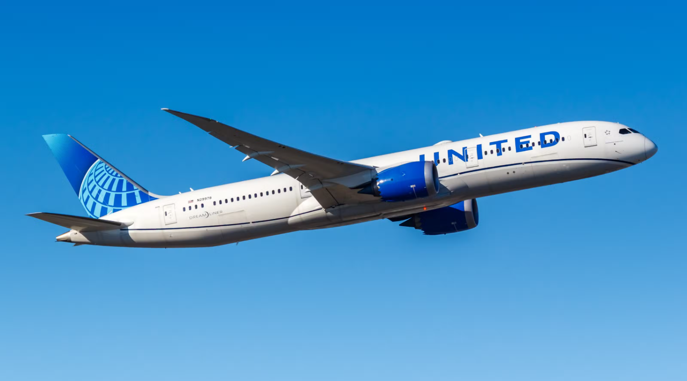

# Skytrax United Airlines Analysis

Analyzed 4,458 United Airlines reviews (2015–2025) using SQL (Snowflake), Python (Pandas, Seaborn), and Mode Studio for dashboarding. The analysis reveals persistent dissatisfaction, especially among Economy leisure travelers, with seat comfort, WiFi, and food emerging as universal weaknesses. Insights highlight where targeted improvements could most effectively raise customer satisfaction and loyalty.

## 1. Overview

1.1 Scope
- 4,458 United Airlines reviews from 2015–2025, sourced from Skytrax (AirlineQuality.com).
- Reviews cover customer demographics, service ratings, aircraft, and routes.

1.2 Goal
- Identify key drivers of customer satisfaction and turn them into targeted improvement actions for United Airlines.

1.3 Method
- SQL (Snowflake) for data extraction, cleaning, and preparation.
- Python (Pandas, Seaborn) for exploratory analysis, trends, and correlation heatmaps.
- Mode Studio for building an interactive dashboard. 

1.4 Top Insights
- Weak sentiment overall: An average rating of 2.0/5 across six metrics (seat comfort, food, entertainment, cabin staff, ground service, WiFi) and only 18.12% recommendation rate. 
- Economy travelers dominate feedback: 80% of reviews are from Economy passengers, mostly leisure travelers.
- Economy satisfaction drivers: Seat Comfort, Food & Beverages, and WiFi are the biggest pain points.
- Non-Economy satisfaction drivers: Cabin Staff and Food quality are critical; any shortfall significantly lowers overall ratings.

## 2. Data Processing and Analysis Workflow

2.1. Data
- Loaded 4,458 reviews from Skytrax database, using SQL for data querying.
- Validated schema (data types, null handling, consistency checks).

2.2. Cleaning
- Standardized countries, cities, routes, aircraft names, and cabin/seat types.
- Addressed missing or out-of-range values to ensure reliability.

2.3. Feature Preparation
- Flags for verified vs unverified reviews.
- Flags for Economy vs Non-Economy cabins.
- Route structure prepared (Origin – Destination – Transit).

2.4. Modeling/Analysis
- Correlation analysis of seven satisfaction factors (seat, staff, food, ground, entertainment, WiFi, value for money).
- Separate correlation matrices for Economy vs Non-Economy.
- Trend analysis for ratings and recommendations over time.

## 3. Insights

3.1. Economy Class
- Top pain points: Seat Comfort (2.2/5), WiFi (1.9/5), Food (2.1/5).
- Cabin Staff is relatively stronger, but not enough to offset weak product ratings.
- Correlation: Food and Staff Service ratings move together: when food is rated poorly, staff is also perceived less favorably.

3.2. Non-Economy Classes (Business, Premium, First)
- Critical factors: Seat Comfort and Food quality drive overall satisfaction.
- Premium customers have higher expectations; small issues (e.g., poor food presentation, seat discomfort) significantly lower ratings.
- Correlation: Strong link between Food quality and overall experience: premium passengers weigh dining heavily.

## 4. Recommendations

4.1. Economy Class
- Improve Seat Comfort: Upgrade cushioning, recline, and legroom to enhance long-haul experience.
- Enhance Food Offerings: Better menu variety and consistent quality to address one of the lowest-rated areas.
- Fix WiFi Reliability: Invest in stronger connectivity to close one of the biggest service gaps.

4.2. Non-Economy Classes
- Premium Dining: Partner with top chefs or food brands to elevate food quality and presentation.
- Consistency in Service: Cabin staff training to ensure attentive, professional service across all routes.
- Comfort Enhancements: Upgrade premium seating features (padding, lie-flat reliability, space).

## 5. Key Takeaway

United Airlines faces a customer satisfaction crisis: with an average rating of 2.0/5 and only 18% of customers recommending the airline, reviews highlight persistent dissatisfaction. Feedback is dominated by Economy leisure travelers, who consistently cite seat comfort, WiFi, and food as the weakest points. Premium passengers, though fewer, are highly sensitive to comfort and dining quality.

## 5. Key Learnings

5.1. Technical Skills
- Writing Snowflake SQL: Developed efficient queries for data extraction, cleaning, and creating reproducible data pipelines.
- Building Mode Studio Reports: Created interactive dashboards with dynamic filters and drill-downs for routes, aircraft, and customer profiles.
- Python (Pandas, Seaborn): Used Pandas for exploratory data analysis and preprocessing; applied Seaborn for creating trend plots and correlation heatmaps across satisfaction factors.

5.2. Analytical Skills
- Segment-first approach: By separating Economy vs Non-Economy cabins, different satisfaction drivers became clear.
Economy: Seat Comfort, WiFi, and Food quality were the weakest factors.
Non-Economy: Seat Comfort and Food were critical; small issues had a disproportionate impact on overall satisfaction.
- Correlation analysis: Learned to interpret satisfaction drivers carefully. For example, while food quality and staff service often correlate, correlation does not mean improving one automatically improves the other.

5.3. Communication
- Storytelling with data: Organized the dashboard into a logical flow (Overview → Trends → Satisfaction Breakdown → Customer Profiles → Aircraft & Routes → Drivers).
- Actionable framing: Translated metrics into improvement levers (e.g., upgrade WiFi, improve food menus, train staff for consistency, prioritize seat comfort on long-haul routes)

## 6. Limitations
- Single-airline scope: Analysis is limited to United Airlines without competitor benchmarks.
- Unobserved variables: No data on fare class, flight delays, aircraft age/configuration, or load factors.
- Correlation-only insights: Findings reflect associations, not causality; factors may be confounded by route length or season.
- Verified vs unverified weighting: Dataset treats both equally; potential bias from unverifiable reviews remains unexplored.

## 7. Next steps
- Benchmarking: Compare United with peers like Delta, American, or Emirates for context.
- Text Analysis: Use NLP to analyze review text for recurring themes (delays, service attitude, comfort complaints).
- Modeling: Apply regression or machine learning to quantify the impact of individual factors on recommendation likelihood.
- Data Enrichment: Incorporate external data on delays, cancellations, aircraft utilization, and ticket pricing.
- Prioritization: Build an “impact vs effort” matrix to help United focus on the most actionable improvements.
- Automation: Set up pipelines to update the dashboard monthly with new Skytrax reviews.